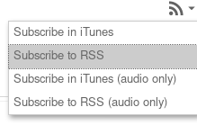
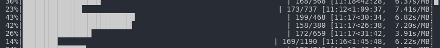

# Panopto Videos Downloader

Panopto Vidoes Downloader is a Python script for downloading Technion course videos from Panopto 

# Getting Started

## Installation

Clone the repo
```bash
$ git clone https://github.com/dlior/panopto-videos-downloader.git
$ cd panopto-videos-downloader
$ pip install -r requirements.txt
```

## Using Panopto Vidoes Downloader

1. In Google Chrome subscribe to RSS

    

2. Copy the URL and paste it in the url variable in the script then save file

```python
url = "RSS URL Here"
```

3. Open terminal and run the script:
```bash
$ python main.py
```

## Example

RSS URL for Technion course 094224 - Data Structures and Algorithms (Tutorials)

```python
url = "http://panoptotech.cloud.panopto.eu/Panopto/Podcast/Podcast.ashx?courseid=2b22b19c-f958-4153-9765-a97d00e07ad5&type=mp4"
```



## Disclaimer

The tool above is for research purpose only not for human consumption, I am not responsible for any use of this program, please read [Panopto Privacy Policy](https://www.panopto.com/privacy/) before using this.


